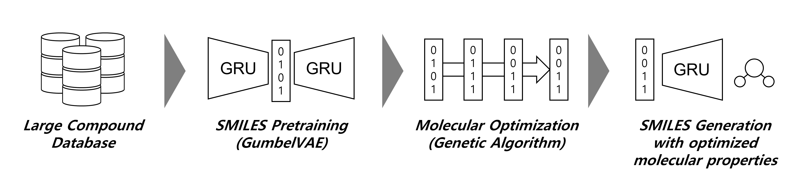

# MolBit: De novo Drug Design via Binary Representations of SMILES for avoiding the Posterior Collapse Problem
2021 IEEE International Conference on Bioinformatics and Biomedicine (BIBM)



--------------------------------------------------------------------------------------------
## Abstract
Deep generative models for molecular generation have significantly accelerated advancements in de novo drug design by enabling the generation of novel molecular structures represented in Simplified Molecular-Input Line-Entry System (SMILES) or molecular graph formats. Many studies have proposed the use of combinations of variational autoencoders (VAEs) with autoregressive generators such as recurrent neural networks (RNNs) for generating SMILES strings. However, RNN-VAE models often face a well-known issue called posterior collapse, where different latent vectors result in indistinguishable molecular distributions.

In this study, we introduce a Gumbel-Softmax-based generative model, MolBit, along with a genetic algorithm-based molecular property optimization method. Our results demonstrate that the proposed model effectively avoids the posterior collapse problem and outperforms existing de novo drug design models using SMILES representations.

--------------------------------------------------------------------------------------------
## Installation
We recommend using Anaconda for the installation of MolBit. The following commands will guide you in setting up a conda environment for MolBit:

```
git clone https://github.com/mathcom/MolBit.git
cd MolBit
conda env create -f environment.yml
```

## Tutorial
Follow the steps below to get started with MolBit:
1. Prepare the Dataset:
- Create a directory named data and prepare a SMILES dataset for training.
- We recommend downloading the GDB-13 dataset from [GDB13 Download Page](https://gdb.unibe.ch/downloads/) for this tutorial.

2. Preprocess the Data:
- Run the notebook 0_data_preprocess.ipynb to transform the dataset into the format required for training.
- The preprocessed data will be saved in the data directory.

3. Train the Model:
- Execute 1_training.ipynb to train the GumbelVAE on the preprocessed GDB-13 dataset.
- All results, including trained models and logs, will be stored in the results directory.

--------------------------------------------------------------------------------------------
## Citation
If you use MolBit in your research, please cite our paper as follows:
```
@inproceedings{choi2021molbit,
  title={MolBit: De novo Drug Design via Binary Representations of SMILES for Avoiding the Posterior Collapse Problem},
  author={Choi, Jonghwan and others},
  booktitle={2021 IEEE International Conference on Bioinformatics and Biomedicine (BIBM)},
  pages={966--9668},
  year={2021},
  organization={IEEE},
  doi={10.1109/BIBM52615.2021.9669668}
}
```
For more details, visit the [paper](https://doi.org/10.1109/BIBM52615.2021.9669668).

--------------------------------------------------------------------------------------------
## Contact
For any inquiries, please contact us at:
```
jonghwanc@hallym.ac.kr
```